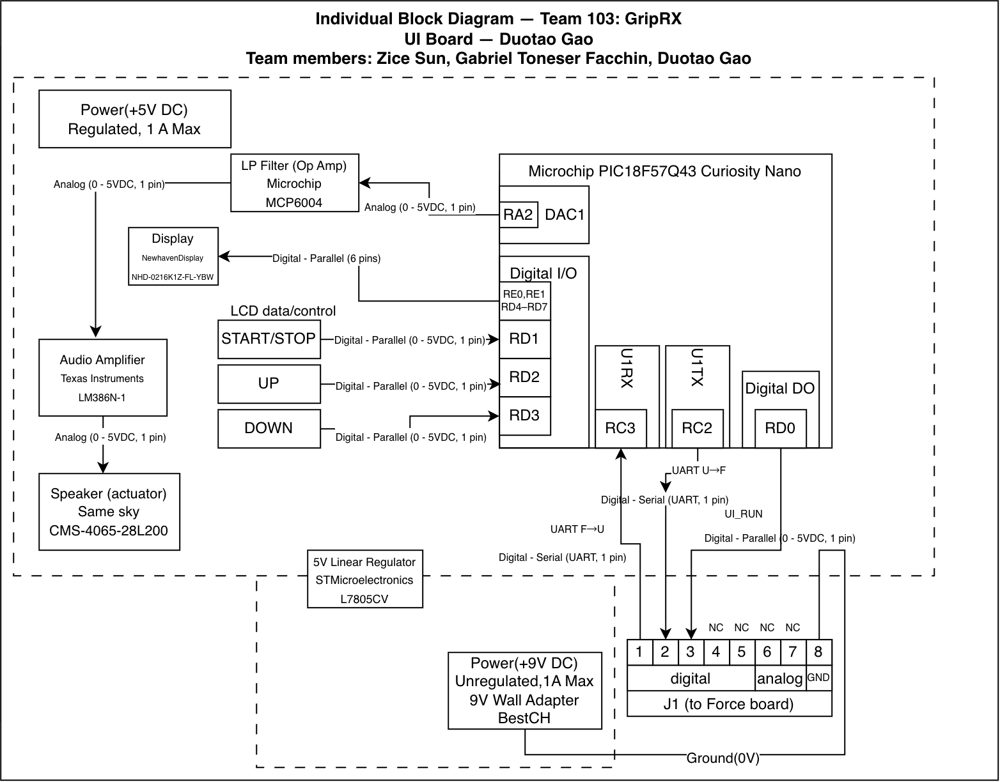

## Overview
This block diagram shows the user interface board designed by Duotao Gao for the GripRx project of Team 103. The Microchip PIC18F57Q43 Curiosity Nano reads the start/stop, up and down buttons, controls the character LCD, and generates sound feedback through the DAC, active low-pass filter, audio amplifier and speaker. The user interface board is connected to the force gauge board via the J1 connector using UART, UI_RUN signals and the common ground. The proposed power supply scheme is a 9V wall-plug power supply and a 5V linear voltage regulator. Component selection and electrical parameters will be verified during the detailed design stage.

## Block Diagram 

## Generative AI Disclosure

I used ChatGPT to help interpret the assignment requirements, organize diagram labels, and draft the overview. I also used an AI-generated guide provided by a teammate as a reference. I edited the diagram and webpage myself.

Query text:
1. Could you please tell me what this assignment is about.
